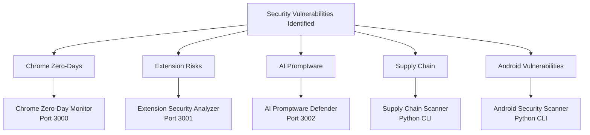

# Google Security Solutions - MVP Repository Series

[](https://github.com/yourusername/google-security-solutions)
[](LICENSE)
[](README.md)

## 🛡️ Overview

This repository contains a series of **MVP (Minimum Viable Product)** security solutions designed to address critical vulnerabilities identified in Google's ecosystem. Each solution is a standalone, practical tool that helps mitigate specific security risks discovered in 2024-2025.

> **Based on**: [Google Security Vulnerability Analysis](https://github.com/yourusername/google-security-analysis)

## 📸 Screenshots

### Dashboard Overview

*All 5 MVP solutions addressing different security vulnerabilities*

### Chrome Zero-Day Monitor

*Real-time monitoring of Chrome zero-day vulnerabilities*

### Extension Security Analyzer

*Detecting malicious Chrome extensions like Phantom Shuttle*

### AI Promptware Defender

*Testing and defending against prompt injection attacks*

## 🎯 Solutions

### 1. 🔴 [Chrome Zero-Day Monitor](./chrome-zero-day-monitor/)
**Addresses**: Critical Chrome zero-day vulnerabilities (CVE-2025-10585, CVE-2025-2783, etc.)

**Features**:
- ✅ Real-time CVE monitoring
- ✅ Zero-day detection and alerting
- ✅ Patch status tracking
- ✅ Interactive web dashboard
- ✅ Automated checking

**Screenshot**:


**Quick Start**:
```bash
cd chrome-zero-day-monitor
npm install
npm start
# Open http://localhost:3000
```

---

### 2. 🟡 [Extension Security Analyzer](./extension-security-analyzer/)
**Addresses**: Phantom Shuttle and malicious Chrome extensions

**Features**:
- ✅ Permission analysis and risk scoring
- ✅ Phantom Shuttle pattern detection
- ✅ Network behavior analysis
- ✅ Malicious code detection
- ✅ Web interface

**Screenshot**:


**Quick Start**:
```bash
cd extension-security-analyzer
npm install
node analyze.js ./path/to/extension
```

---

### 3. 🟠 [AI Promptware Defender](./ai-promptware-defender/)
**Addresses**: Gemini AI promptware attacks and prompt injection

**Features**:
- ✅ Prompt injection detection
- ✅ Input sanitization testing
- ✅ Response validation
- ✅ Attack pattern library
- ✅ Security testing suite

**Screenshot**:


**Quick Start**:
```bash
cd ai-promptware-defender
npm install
npm test
```

---

### 4. 🔵 [Supply Chain Scanner](./supply-chain-scanner/)
**Addresses**: Open source dependency vulnerabilities (20+ found)

**Features**:
- ✅ Dependency scanning (package.json, requirements.txt)
- ✅ CVE vulnerability checking
- ✅ Outdated package detection
- ✅ Security report generation
- ✅ CI/CD integration ready

**Screenshot**:


**Quick Start**:
```bash
cd supply-chain-scanner
pip install -r requirements.txt
python scan.py ./project-path
```

---

### 5. 🟢 [Android Security Scanner](./android-security-scanner/)
**Addresses**: Android zero-day vulnerabilities (CVE-2025-48633, CVE-2025-48572)

**Features**:
- ✅ Android version checking
- ✅ Security patch verification
- ✅ Vulnerability detection
- ✅ ADB integration
- ✅ Security reporting

**Screenshot**:


**Quick Start**:
```bash
cd android-security-scanner
pip install -r requirements.txt
python scan.py --device
```

## 🚀 Quick Start

### Prerequisites
- **Node.js** 16+ (for JavaScript solutions)
- **Python** 3.8+ (for Python solutions)
- **Git** (for cloning)
- Modern web browser

### Installation

```bash
# Clone the repository
git clone https://github.com/yourusername/google-security-solutions.git
cd google-security-solutions

# Install Node.js solutions
cd chrome-zero-day-monitor && npm install && cd ..
cd extension-security-analyzer && npm install && cd ..
cd ai-promptware-defender && npm install && cd ..

# Install Python solutions
cd supply-chain-scanner && pip install -r requirements.txt && cd ..
cd android-security-scanner && pip install -r requirements.txt && cd ..
```

### Running All Services

```bash
# Terminal 1: Chrome Monitor
cd chrome-zero-day-monitor && npm start

# Terminal 2: Extension Analyzer
cd extension-security-analyzer && npm start

# Terminal 3: AI Defender
cd ai-promptware-defender && npm start
```

## 📊 Architecture



## 🎯 Use Cases

### For Security Teams
- **Proactive Monitoring**: Detect zero-days before they impact your organization
- **Extension Vetting**: Analyze Chrome extensions before deployment
- **AI Security**: Test AI systems for prompt injection vulnerabilities
- **Supply Chain Security**: Scan dependencies for known vulnerabilities
- **Device Security**: Verify Android device security status

### For Developers
- **Dependency Management**: Keep dependencies secure and up-to-date
- **Code Review**: Analyze extensions and AI integrations
- **Security Testing**: Test applications for vulnerabilities
- **CI/CD Integration**: Automate security scanning

### For Organizations
- **Risk Assessment**: Understand security posture
- **Compliance**: Meet security requirements
- **Incident Response**: Quick vulnerability detection
- **Security Awareness**: Educate teams on threats

## 📈 Statistics

Based on the vulnerability analysis:

- **9 Critical Zero-Days** addressed by Chrome Monitor
- **170+ Domains** protected by Extension Analyzer
- **20+ Dependency Vulnerabilities** detected by Supply Chain Scanner
- **4 Android Zero-Days** covered by Android Scanner
- **Multiple AI Attacks** prevented by Promptware Defender

## 🔒 Security Notice

⚠️ **These solutions are for defensive security purposes only**

- ✅ Use to protect your systems
- ✅ Test your own applications
- ✅ Educational and research use
- ❌ Do not use for malicious purposes
- ❌ Do not attack systems without authorization

## 📚 Documentation

Each solution includes comprehensive documentation:

- **README.md**: Usage instructions and examples
- **Code Comments**: Inline documentation
- **API Documentation**: Endpoint descriptions
- **Configuration Guides**: Setup instructions

## 🤝 Contributing

Contributions are welcome! Please:

1. Fork the repository
2. Create a feature branch
3. Make your changes
4. Add tests if applicable
5. Submit a pull request

### Contribution Guidelines
- Follow existing code style
- Add documentation for new features
- Include examples
- Test your changes

## 📝 License

This project is licensed under the MIT License - see the [LICENSE](LICENSE) file for details.

## 🙏 Acknowledgments

- Based on [Google Security Vulnerability Analysis](https://github.com/yourusername/google-security-analysis)
- CVE Database for vulnerability information
- Security research community

## 📞 Support

- **Issues**: [GitHub Issues](https://github.com/yourusername/google-security-solutions/issues)
- **Discussions**: [GitHub Discussions](https://github.com/yourusername/google-security-solutions/discussions)
- **Documentation**: See individual solution README files

## 🗺️ Roadmap

### Phase 1: Core MVP Solutions ✅
- [x] Chrome Zero-Day Monitor
- [x] Extension Security Analyzer
- [x] AI Promptware Defender
- [x] Supply Chain Scanner
- [x] Android Security Scanner

### Phase 2: Integration (In Progress)
- [ ] Unified dashboard
- [ ] API integration
- [ ] Automated reporting
- [ ] Cloud deployment options

### Phase 3: Advanced Features (Planned)
- [ ] Machine learning enhancements
- [ ] Real-time threat intelligence
- [ ] Advanced analytics
- [ ] Enterprise features

## 📸 Screenshot Instructions

To add screenshots to this repository:

1. **Take Screenshots**:
   - Chrome Monitor: `http://localhost:3000`
   - Extension Analyzer: `http://localhost:3001`
   - AI Defender: `http://localhost:3002`
   - CLI tools: Run commands and capture output

2. **Save to `screenshots/` directory**:
   ```
   screenshots/
   ├── overview.png
   ├── chrome-monitor.png
   ├── extension-analyzer.png
   ├── ai-defender.png
   ├── supply-chain-scan.png
   └── android-scanner-results.png
   ```

3. **Update README**: Screenshot references are already included

## ⭐ Star History

If you find this project useful, please consider giving it a star! ⭐

---

**Last Updated**: December 2025  
**Status**: MVP - Production Ready  
**Maintainer**: [Your Name](https://github.com/yourusername)
