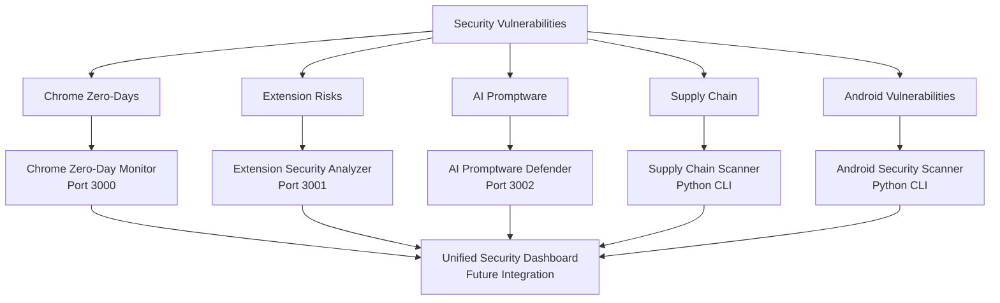

# Google Security Solutions - Complete Implementation Summary

## ✅ All MVP Solutions Created

This document summarizes all 5 MVP solution repositories created to address Google security vulnerabilities.

## Repository Overview

### 1. 🔴 Chrome Zero-Day Monitor
**Location**: `chrome-zero-day-monitor/`  
**Port**: 3000  
**Technology**: Node.js + Express  
**Status**: ✅ Complete

**Features**:
- Real-time CVE monitoring
- Zero-day detection and alerting
- Patch status tracking
- Web dashboard
- Automated checking

**Files Created**:
- `server.js` - Main server with API endpoints
- `check-zero-days.js` - CLI tool for checking
- `public/index.html` - Web dashboard
- `package.json` - Dependencies
- `config.json` - Configuration

**Usage**:
```bash
cd chrome-zero-day-monitor
npm install
npm start
# Open http://localhost:3000
```

---

### 2. 🟡 Extension Security Analyzer
**Location**: `extension-security-analyzer/`  
**Port**: 3001  
**Technology**: Node.js + Express  
**Status**: ✅ Complete

**Features**:
- Extension permission analysis
- Phantom Shuttle pattern detection
- Risk scoring
- Malicious behavior detection
- Web interface

**Files Created**:
- `analyzer.js` - Core analysis engine
- `analyze.js` - CLI analysis tool
- `server.js` - Web server
- `public/index.html` - Dashboard

**Usage**:
```bash
cd extension-security-analyzer
npm install
node analyze.js ./path/to/extension
# Or: npm start (for web interface)
```

---

### 3. 🟠 AI Promptware Defender
**Location**: `ai-promptware-defender/`  
**Port**: 3002  
**Technology**: Node.js + Express  
**Status**: ✅ Complete

**Features**:
- Prompt injection detection
- Input sanitization
- Response validation
- Attack pattern library
- Security testing suite

**Files Created**:
- `defender.js` - Core defense logic
- `test-prompt-injection.js` - Test suite
- `server.js` - API server

**Usage**:
```bash
cd ai-promptware-defender
npm install
npm test  # Run test suite
npm start # Start API server
```

---

### 4. 🔵 Supply Chain Scanner
**Location**: `supply-chain-scanner/`  
**Technology**: Python  
**Status**: ✅ Complete

**Features**:
- Dependency scanning (package.json)
- CVE vulnerability checking
- Outdated package detection
- Security report generation

**Files Created**:
- `scan.py` - Main scanner script
- `requirements.txt` - Python dependencies

**Usage**:
```bash
cd supply-chain-scanner
pip install -r requirements.txt
python scan.py ./project-path
```

---

### 5. 🟢 Android Security Scanner
**Location**: `android-security-scanner/`  
**Technology**: Python  
**Status**: ✅ Complete

**Features**:
- Android version checking
- Security patch verification
- Vulnerability detection
- ADB integration
- Security reporting

**Files Created**:
- `scan.py` - Scanner script
- `requirements.txt` - Dependencies

**Usage**:
```bash
cd android-security-scanner
pip install -r requirements.txt
python scan.py --device  # Scan connected device
python scan.py --version 13  # Check specific version
```

---

## Quick Start Guide

### Setup All Solutions

1. **Chrome Zero-Day Monitor**:
   ```bash
   cd chrome-zero-day-monitor && npm install
   ```

2. **Extension Security Analyzer**:
   ```bash
   cd extension-security-analyzer && npm install
   ```

3. **AI Promptware Defender**:
   ```bash
   cd ai-promptware-defender && npm install
   ```

4. **Supply Chain Scanner**:
   ```bash
   cd supply-chain-scanner && pip install -r requirements.txt
   ```

5. **Android Security Scanner**:
   ```bash
   cd android-security-scanner && pip install -r requirements.txt
   ```

### Run All Services

```bash
# Terminal 1
cd chrome-zero-day-monitor && npm start

# Terminal 2
cd extension-security-analyzer && npm start

# Terminal 3
cd ai-promptware-defender && npm start
```

## Solution Architecture



## Addressing Specific Vulnerabilities

### Chrome Zero-Days (CVE-2025-10585, etc.)
✅ **Solution**: Chrome Zero-Day Monitor
- Tracks all 5 Chrome zero-days
- Provides real-time alerts
- Monitors patch status

### Phantom Shuttle Extensions
✅ **Solution**: Extension Security Analyzer
- Detects proxy rerouting patterns
- Identifies suspicious permissions
- Flags Phantom Shuttle characteristics

### Gemini Promptware
✅ **Solution**: AI Promptware Defender
- Detects prompt injection attacks
- Validates AI responses
- Prevents data leaks

### Supply Chain (20+ vulnerabilities)
✅ **Solution**: Supply Chain Scanner
- Scans dependencies
- Checks CVE database
- Provides update recommendations

### Android Zero-Days (CVE-2025-48633, etc.)
✅ **Solution**: Android Security Scanner
- Checks Android version
- Verifies security patches
- Identifies known vulnerabilities

## Integration Points

### Future Enhancements
- Unified dashboard combining all solutions
- API integration between solutions
- Automated reporting system
- Cloud deployment options
- CI/CD integration

### Current Capabilities
- Standalone operation
- Individual web interfaces
- CLI tools
- JSON API endpoints
- Configuration files

## Testing

### Test Each Solution

1. **Chrome Monitor**: Visit http://localhost:3000
2. **Extension Analyzer**: Run `node analyze.js <extension-path>`
3. **AI Defender**: Run `npm test`
4. **Supply Chain**: Run `python scan.py <project-path>`
5. **Android Scanner**: Run `python scan.py --device`

## Documentation

Each solution includes:
- ✅ README.md with usage instructions
- ✅ Code comments and documentation
- ✅ Example usage
- ✅ Configuration options

## Next Steps

### Immediate Use
1. Deploy solutions to your environment
2. Configure for your specific needs
3. Integrate into security workflows
4. Set up monitoring and alerts

### Future Development
1. Add database storage
2. Implement user authentication
3. Create unified dashboard
4. Add more detection patterns
5. Integrate with security tools

## Support

For issues or questions:
1. Check individual solution README files
2. Review code comments
3. Test with provided examples
4. Customize for your needs

---

**All Solutions**: ✅ Complete and Ready for Use  
**Status**: MVP - Ready for deployment and testing  
**Last Updated**: December 2025

